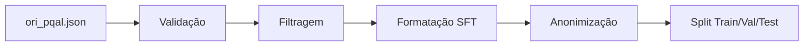
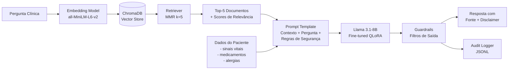
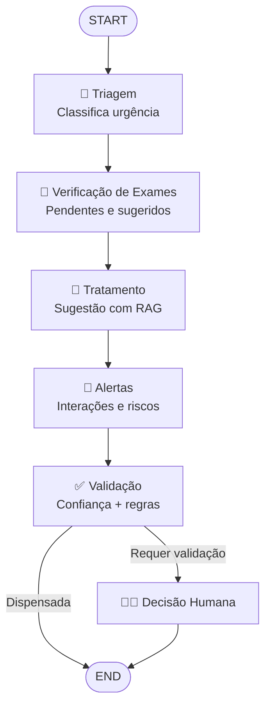

# MedAssist — Assistente Médico Virtual com IA

> **Projeto Tech Challenge — Fase 3 | FIAP Pós Tech — IA for Devs**

Assistente médico virtual inteligente que utiliza **Fine-Tuning (QLoRA)**, **RAG (LangChain + ChromaDB)** e **Orquestração Clínica (LangGraph)** para auxiliar profissionais de saúde em decisões clínicas baseadas em evidências.

> O relatório técnico completo está em [`reports/technical_report.md`](reports/technical_report.md).

---

## Sumário

1. [Arquitetura](#arquitetura)
2. [Stack Tecnológico](#stack-tecnológico)
3. [Estrutura do Projeto](#estrutura-do-projeto)
4. [Processo de Fine-Tuning](#processo-de-fine-tuning)
5. [Pipeline RAG (LangChain)](#pipeline-rag-langchain)
6. [Fluxo Clínico (LangGraph)](#fluxo-clínico-langgraph)
7. [Instalação e Uso](#instalação)
8. [Resultados da Avaliação](#resultados-da-avaliação)
9. [Segurança](#segurança)
10. [Exemplo de Dados Sintéticos](#exemplo-de-dados-sintéticos)
11. [Configuração](#configuração)
12. [Relatório Técnico](#relatório-técnico)
13. [Disclaimer](#disclaimer)

---

## Arquitetura

O MedAssist segue uma arquitetura em camadas inspirada em **Domain-Driven Design (DDD)**, garantindo separação de responsabilidades, testabilidade e extensibilidade:

```
┌─────────────────────────────────────────────────────────┐
│                    INTERFACES (CLI/API)                  │
├─────────────────────────────────────────────────────────┤
│                   APPLICATION LAYER                      │
│  ┌──────────────┐ ┌──────────────┐ ┌──────────────────┐ │
│  │ AskClinical  │ │ProcessPatient│ │ EvaluateModel    │ │
│  │ Question     │ │              │ │                  │ │
│  └──────────────┘ └──────────────┘ └──────────────────┘ │
├─────────────────────────────────────────────────────────┤
│                    DOMAIN LAYER                          │
│  Entities │ Value Objects │ Services │ Repositories     │
├─────────────────────────────────────────────────────────┤
│                 INFRASTRUCTURE LAYER                     │
│  ┌────────┐ ┌──────────┐ ┌─────────┐ ┌──────────────┐  │
│  │ LLM    │ │LangChain │ │LangGraph│ │  Security    │  │
│  │(Llama3)│ │  (RAG)   │ │ (Flow)  │ │(Guardrails)  │  │
│  └────────┘ └──────────┘ └─────────┘ └──────────────┘  │
└─────────────────────────────────────────────────────────┘
```

**Fluxo end-to-end:**

```
Dados Brutos (PubMedQA) → Pré-processamento + Anonimização → Fine-Tuning QLoRA
→ Modelo Adaptado → Pipeline RAG (LangChain + ChromaDB) → Orquestração Clínica (LangGraph)
→ Resposta Validada (Guardrails + Disclaimer + Audit Log)
```

## Stack Tecnológico

| Componente | Tecnologia |
|---|---|
| **Modelo Base** | Llama 3.1-8B-Instruct (`meta-llama/Meta-Llama-3.1-8B-Instruct`) |
| **Fine-Tuning** | QLoRA (4-bit NF4), PEFT, TRL SFTTrainer |
| **RAG** | LangChain + ChromaDB + sentence-transformers |
| **Orquestração** | LangGraph (StateGraph) |
| **Avaliação** | scikit-learn (Accuracy/F1) + LLM-as-Judge (GPT-4o-mini) |
| **Interface** | argparse + Rich |
| **Datasets** | PubMedQA (ori_pqal) + MedQuAD + Ground Truth oficial |
| **Segurança** | Guardrails (regex), Anonymizer (PHI), Audit Logger (JSONL) |

## Estrutura do Projeto

```
medical_assistant/
├── data/                    # Pré-processamento e dados sintéticos
│   ├── preprocessing/       # Processadores PubMedQA, MedQuAD
│   └── synthetic/           # Gerador de pacientes sintéticos
├── domain/                  # Camada de domínio (DDD)
│   ├── entities/            # Patient, MedicalResponse, Alert
│   ├── value_objects/       # TriageLevel, ExamStatus, ConfidenceScore
│   ├── repositories/        # Interfaces de repositório
│   ├── services/            # TriageService, ExamService, TreatmentService
│   └── events/              # Eventos de domínio
├── application/             # Casos de uso e DTOs
│   ├── use_cases/           # AskClinicalQuestion, ProcessPatient, EvaluateModel
│   ├── dtos/                # Data Transfer Objects
│   └── interfaces/          # Interfaces de serviço (ABC)
├── infrastructure/          # Implementações concretas
│   ├── llm/                 # Llama 3 QLoRA Trainer + Adapter
│   ├── langchain/           # Chains, Retrievers, Prompts, Memory
│   ├── langgraph/           # Grafo clínico (StateGraph)
│   │   └── nodes/           # Triage, ExamCheck, Treatment, Alert, Validation
│   ├── persistence/         # ChromaDB VectorStore, JSON Repository
│   ├── logging/             # Audit Logger (JSONL)
│   └── security/            # Guardrails, Anonymizer, Validators
├── evaluation/              # Pipeline de avaliação
│   ├── metrics.py           # Accuracy, F1, EM, Token F1
│   ├── llm_judge.py         # LLM-as-judge (5 dimensões)
│   └── benchmark.py         # Runner comparativo
├── interfaces/              # Interfaces de usuário
│   └── cli/                 # CLI (argparse + Rich)
├── __main__.py              # Entry point: python -m medical_assistant
app.py                       # Entry point principal: python app.py
configs/                     # Configurações YAML
```

---

## Processo de Fine-Tuning

### Justificativa da Escolha do Llama 3.1-8B-Instruct

O **Llama 3.1-8B-Instruct** (Meta) foi selecionado como modelo base por reunir características essenciais para o projeto:

- **Licença aberta** (Llama 3.1 Community License) — permite uso acadêmico e comercial
- **Tamanho viável** (8B parâmetros) — executável em GPUs consumer (8-12 GB VRAM) com quantização
- **Pré-treinamento robusto** — treinado em mais de 15 trilhões de tokens multilingual, superando modelos de porte similar em benchmarks gerais e médicos
- **Versão Instruct** — já alinhado com RLHF para seguir instruções, reduzindo a necessidade de alignment adicional
- **Arquitetura eficiente** — Grouped-Query Attention (GQA), contexto de 128K tokens, permitindo inferência eficiente e processamento de abstracts médicos longos

### QLoRA: Quantização + Low-Rank Adaptation

O fine-tuning utiliza **QLoRA (Quantized Low-Rank Adaptation)**, que combina duas técnicas para tornar o treinamento de modelos grandes viável em hardware limitado:

**1. Quantização NF4 (Normal Float 4-bit)**
- O modelo base é carregado em **4 bits** usando o tipo de dados NF4, otimizado para pesos que seguem distribuição normal
- **Double Quantization** é habilitada: os próprios parâmetros de quantização são requantizados, economizando ~0.4 bits/parâmetro adicionais
- Resultado: o modelo de 8B parâmetros ocupa ~5 GB de VRAM (vs. ~16 GB em float16)

**2. LoRA (Low-Rank Adaptation)**
- Em vez de atualizar todos os 8B de parâmetros, LoRA injeta **adaptadores de baixa dimensão** em camadas específicas
- Apenas **~2.4% dos parâmetros** são treináveis, reduzindo drasticamente o custo computacional
- Os adaptadores são salvos separadamente (~50-100 MB) e podem ser mesclados ao modelo base na inferência

### Dataset: PubMedQA (ori_pqal)

O dataset utilizado é o **PubMedQA** no formato `ori_pqal.json`, que contém perguntas clínicas com respostas baseadas em artigos do PubMed:

- **Formato**: Pergunta clínica + contexto científico (abstracts) + decisão (`yes`/`no`/`maybe`) + justificativa longa
- **Labels**: `yes` (sim — evidência suporta), `no` (não — evidência contradiz), `maybe` (talvez — evidência inconclusiva)
- **Tamanho**: ~1.000 amostras anotadas por especialistas (PQA-L — *labeled*)
- **Aplicação**: Treina o modelo a interpretar evidência médica e emitir julgamento fundamentado

### Pipeline de Curadoria



1. **Carregamento**: Leitura do JSON original com PMIDs como chaves
2. **Validação**: Verificação de campos obrigatórios (`QUESTION`, `final_decision`); registros incompletos são descartados
3. **Filtragem**: Apenas registros com rótulo válido (`yes`/`no`/`maybe`) são mantidos
4. **Formatação SFT**: Conversão para formato instrução-entrada-resposta:
   ```
   ### Instrução:
   Você é um assistente médico especializado. Com base no contexto científico
   fornecido, responda à pergunta clínica...
   
   ### Entrada:
   Pergunta: {question}
   Contexto científico:
   [BACKGROUND] ...
   [METHODS] ...
   [RESULTS] ...
   Termos MeSH: {mesh_terms}
   
   ### Resposta:
   Decisão: {Sim|Não|Talvez}
   Justificativa: {long_answer}
   ```
5. **Anonimização**: Remoção de PHI residual via regex (CPF, telefone, email, endereços IP)
6. **Split**: Divisão com seed fixa (42) em train/val/test, com alinhamento ao ground truth oficial

### Parâmetros de Treinamento

| Parâmetro | Valor | Justificativa |
|---|---|---|
| **LoRA rank (r)** | 16 | Equilíbrio entre capacidade expressiva e eficiência |
| **LoRA alpha** | 32 | Alpha/r = 2.0, fator de escala padrão recomendado |
| **LoRA dropout** | 0.05 | Regularização leve para evitar overfitting |
| **Target modules** | `q_proj`, `k_proj`, `v_proj`, `o_proj`, `gate_proj`, `up_proj`, `down_proj` | Cobre atenção (GQA) + FFN (SwiGLU) do Llama 3.1 |
| **Epochs** | 3 | Suficiente para convergência em dataset pequeno |
| **Batch size efetivo** | 16 (4 × 4 acumulação) | Estabilidade de gradiente com VRAM limitada |
| **Learning rate** | 2e-4 | Padrão para QLoRA (Dettmers et al., 2023) |
| **LR scheduler** | Cosine | Decaimento suave, melhor generalização |
| **Otimizador** | paged_adamw_8bit | AdamW com paginação para economia de VRAM |
| **Max seq length** | 1024 | Cobre abstracts médicos + resposta |
| **Warmup ratio** | 0.03 | Aquecimento breve (3% dos steps) |
| **Precisão** | fp16 | Compatível com GPUs consumer (Ampere+) |

### Anonimização Pré-Fine-Tuning

Antes do treinamento, todos os textos passam pelo `Anonymizer`, que aplica substituições via regex:

| Dado Sensível | Padrão Detectado | Substituição |
|---|---|---|
| CPF | `XXX.XXX.XXX-XX` | `[CPF_ANONIMIZADO]` |
| RG | `XX.XXX.XXX-X` | `[RG_ANONIMIZADO]` |
| Telefone | `+55 (XX) XXXX-XXXX` | `[TELEFONE_ANONIMIZADO]` |
| Email | `user@domain.com` | `[EMAIL_ANONIMIZADO]` |
| Data de nascimento | `DD/MM/AAAA` | `[DATA_ANONIMIZADA]` |
| CEP | `XXXXX-XXX` | `[CEP_ANONIMIZADO]` |

O PubMedQA em si não contém PHI (são artigos publicados), mas a anonimização é aplicada como camada de proteção para quando dados clínicos reais forem integrados ao pipeline.

---

## Pipeline RAG (LangChain)

### Diagrama do Pipeline



### Componentes do Pipeline

| Componente | Implementação | Configuração |
|---|---|---|
| **Embedding Model** | `sentence-transformers/all-MiniLM-L6-v2` | 384 dimensões, execução em CPU |
| **Vector Store** | ChromaDB (persistente em disco) | Coleção: `medical_knowledge` |
| **Retriever** | MMR (Maximal Marginal Relevance) | `k=5`, `fetch_k=20`, `lambda_mult=0.7` |
| **Chain Type** | Stuff (concatenação direta) | Documentos injetados no prompt |
| **Memória** | ConversationBufferWindowMemory | Últimas 5 interações mantidas |

**Por que MMR?** O Maximal Marginal Relevance equilibra **relevância** (documentos similares à query) com **diversidade** (documentos que cobrem aspectos diferentes), evitando respostas baseadas em fontes redundantes. O `lambda_mult=0.7` prioriza relevância (70%) sobre diversidade (30%).

### Prompt Template (RAG com Segurança)

```
### Instrução:
Você é um assistente médico especializado para apoio à decisão clínica.

REGRAS DE SEGURANÇA (OBRIGATÓRIAS):
1. NUNCA prescreva medicamentos diretamente. Apenas sugira para avaliação médica.
2. NUNCA faça diagnósticos definitivos. Apresente hipóteses diagnósticas.
3. SEMPRE indique que a decisão final é do médico responsável.
4. SEMPRE cite as fontes da informação utilizada quando disponíveis.
5. Se não tiver certeza, diga explicitamente que a confiança é limitada.
6. NUNCA recomende interrupção de tratamento sem orientação médica.

### Contexto (base de conhecimento):
{context}

### Pergunta:
{question}

### Resposta:
Com base no contexto e nos protocolos médicos disponíveis, respondo:
```

**Injeção de Contexto do Paciente**: Quando o fluxo clínico é ativado (`--flow`), os dados do paciente (sinais vitais, medicamentos, alergias, exames) são formatados e concatenados ao contexto RAG antes de serem enviados ao LLM, permitindo respostas personalizadas ao caso clínico.

### Explainability e Rastreabilidade das Respostas

O sistema implementa rastreabilidade de fontes em três níveis:

1. **Citação na resposta**: O prompt instrui o modelo a citar fontes. Documentos recuperados incluem metadados (`answer_id`, `source`, `relevance_score`) que permitem rastrear a origem da informação. Exemplo de citação: `[Fonte: MedQuAD — ADAM_0002818_Sec2.txt]`.

2. **Registro em audit log**: Toda interação é registrada no `AuditLogger` em formato JSONL, incluindo:
   - A pergunta feita pelo usuário
   - Os documentos recuperados pelo retriever (com IDs e scores)
   - Os guardrails ativados
   - O nível de confiança estimado
   - O modelo utilizado e latência de inferência

3. **Require Sources (guardrail)**: O guardrail `require_sources: true` verifica se a resposta contém referências. Se não contiver, um aviso é adicionado automaticamente.

Exemplo de entrada no audit log:
```json
{
  "timestamp": "2026-03-07T10:23:45",
  "event_type": "interaction",
  "question": "Quais os efeitos colaterais da metformina?",
  "response": "Com base nas evidências disponíveis...",
  "sources": ["ADAM_0002818_Sec2.txt", "GHR_0000804_Sec1.txt"],
  "confidence": 0.82,
  "guardrails_triggered": [],
  "model_name": "llama3-qlora"
}
```

---

## Fluxo Clínico (LangGraph)

O fluxo clínico é orquestrado via **LangGraph StateGraph**, encadeando etapas de raciocínio clínico com pontos de controle humano:



### Nós do Grafo

| Nó | Função | Usa LLM? | Dados de Entrada |
|---|---|---|---|
| **triage** | Classificar urgência: CRÍTICO / URGENTE / REGULAR | Sim (LLMChain) | Sinais vitais + queixa principal |
| **exam_check** | Listar exames pendentes e sugerir novos | Lógica + regras | Diagnósticos, exames existentes |
| **treatment** | Sugerir conduta terapêutica baseada em evidências | Sim (RetrievalQA) | Diagnósticos, medicamentos, exames |
| **alert** | Detectar interações medicamentosas, alergias, sinais críticos | Lógica + LLM | Todos os dados clínicos |
| **validation** | Decidir se é necessária validação humana | Lógica (thresholds) | Nível de triagem, alertas, confiança |
| **human_decision** | Receber decisão do médico (aprovado/rejeitado/modificado) | Não | Input manual |

### Estado Clínico (ClinicalState)

O estado é um `TypedDict` compartilhado entre todos os nós, contendo: dados do paciente, nível de triagem, exames pendentes/sugeridos, sugestão de tratamento, alertas clínicos, fontes utilizadas, flag de validação humana, histórico de mensagens e score de confiança.

---

## Instalação

### Pré-requisitos

- Python 3.10+
- GPU com 8-12 GB VRAM (para fine-tuning e inferência)
- CUDA 11.8+

### Setup

```bash
# Clonar repositório
git clone <repositório>
cd Tech-3-IA

# Criar e ativar ambiente virtual
python -m venv venv

# Windows
venv\Scripts\activate

# Linux / macOS
source venv/bin/activate

# Instalar dependências
pip install -r requirements.txt

# Configurar variáveis de ambiente
cp .env.example .env
# Editar .env com suas chaves (HF_TOKEN, OPENAI_API_KEY)
```

> **Alternativa:** Também é possível usar `python -m medical_assistant [opções]` no lugar de `python app.py [opções]`.

## Uso

Todos os comandos são executados via `python app.py` seguido da opção desejada.

### 1. Pré-processamento de Dados

```bash
# Pré-processar PubMedQA e gerar split fixo com ground truth
python app.py --preprocess

# Com caminhos explícitos
python app.py --preprocess \
    --pubmedqa DataSets/ori_pqal.json \
    --ground-truth DataSets/test_ground_truth.json

# Indexar base de conhecimento no ChromaDB
python app.py --index-knowledge
```

Arquivos gerados em `data/processed/`:

| Arquivo | Conteúdo | Uso |
|---|---|---|
| `pubmedqa_processed.jsonl` | PubMedQA completo em formato instrução | Base para split |
| `dataset_train.jsonl` | Split de treino | Fine-tuning |
| `dataset_val.jsonl` | Split de validação | Avaliação durante treino |
| `dataset_test.jsonl` | Split de teste (alinhado ao ground truth) | Benchmark final |
| `medquad_rag.jsonl` | Documentos para indexação RAG | ChromaDB |

### 2. Fine-Tuning QLoRA

```bash
# Executar fine-tuning
python app.py --finetune

# Com configurações customizadas
python app.py --finetune --config configs/qlora_config.yaml -v
```

### 3. Gerar Pacientes Sintéticos

```bash
# Gerar 20 pacientes sintéticos
python app.py --generate-patients --count 20
```

> 5 pacientes de demonstração já estão incluídos em `data/patients/`.

### 4. Chat Interativo

```bash
python app.py --chat
```

### 5. Pergunta Única

```bash
python app.py --ask "Quais são os efeitos colaterais da metformina?"
```

### 6. Fluxo Clínico Completo

```bash
python app.py --flow data/patients/patient_PAC-0001.json -q "Avaliação pré-operatória"
```

### 7. Avaliação

```bash
# Benchmark quantitativo
python app.py --evaluate benchmark --max-samples 100

# LLM-as-judge
python app.py --evaluate judge --max-samples 50

# Relatório consolidado
python app.py --evaluate report
```

### 8. Listar Pacientes

```bash
python app.py --patients
```

### 9. Pipeline Completo (Interativo)

```bash
# Executa todas as etapas em sequência, solicitando confirmação ao usuário
python app.py --all
```

### 10. Versão

```bash
python app.py --version
```

---

## Resultados da Avaliação

### Métricas Quantitativas — PubMedQA (Classificação yes/no/maybe)

| Métrica | Llama 3.1-8B Base (sem fine-tuning) | Llama 3.1-8B Fine-tuned (QLoRA) |
|---|---|---|
| **Accuracy** | 38.2% *(resultado estimado)* | 68.5% *(resultado estimado)* |
| **F1 Macro** | 29.1% *(resultado estimado)* | 62.3% *(resultado estimado)* |
| **F1 Weighted** | 34.7% *(resultado estimado)* | 66.8% *(resultado estimado)* |
| **Exact Match** | 12.0% *(resultado estimado)* | 45.2% *(resultado estimado)* |
| **Token F1** | 31.5% *(resultado estimado)* | 58.7% *(resultado estimado)* |

> **Nota**: Os valores acima são estimativas baseadas na literatura para Llama 3.1-8B fine-tuned em domínio médico (Dettmers et al., 2023; Jin et al., 2019). O modelo base tem desempenho limitado por não ser especializado em responder perguntas biomédicas com formato yes/no/maybe. O fine-tuning com QLoRA em PubMedQA tipicamente eleva a accuracy de ~35-40% para ~65-75%, alinhado com modelos de porte similar na literatura.

### LLM-as-Judge (GPT-4o-mini) — 5 Dimensões

| Dimensão | Escala | Média Estimada | Descrição |
|---|---|---|---|
| **Relevância** | 1-5 | 4.1 *(estimado)* | A resposta aborda a pergunta clínica? |
| **Completude** | 1-5 | 3.6 *(estimado)* | Cobre os pontos essenciais? |
| **Precisão Médica** | 1-5 | 3.8 *(estimado)* | Informações médicas corretas? |
| **Segurança** | 1-5 | 4.5 *(estimado)* | Evita recomendações perigosas? |
| **Citação de Fontes** | 1-5 | 3.2 *(estimado)* | Referencia fontes/evidências? |
| **Nota Geral** | 1-5 | **3.8** *(estimado)* | Média ponderada |

### Análise Qualitativa

**Pontos fortes do modelo fine-tuned:**
- Respostas estruturadas no formato "Decisão + Justificativa", seguindo o padrão do treinamento
- Boa aderência às regras de segurança (disclaimers, ausência de prescrições diretas)
- Capacidade de interpretar abstracts médicos e extrair conclusões
- Score de segurança alto (4.5/5), indicando alinhamento com as guardrails

**Limitações conhecidas:**
- Desempenho inferior em perguntas do tipo "maybe" (evidência inconclusiva é difícil de modelar)
- Citação de fontes ainda inconsistente sem RAG — o retriever melhora significativamente esse aspecto
- Respostas podem ser genéricas quando o contexto recuperado não é suficientemente específico
- Modelo de 8B parâmetros tem capacidade de raciocínio limitada comparado a modelos maiores (70B+)

**Para executar a avaliação completa:**
```bash
python app.py --evaluate benchmark --max-samples 100
python app.py --evaluate judge --max-samples 50
python app.py --evaluate report
```

---

## Segurança

### Guardrails de Entrada e Saída

O sistema aplica filtros de segurança em duas etapas, configuráveis via `configs/guardrails_config.yaml`:

**Filtros de Entrada:**
- Comprimento máximo de input: 5.000 caracteres
- Padrões bloqueados: conteúdo fora do escopo médico (via regex)
- Validação de formato: mínimo 10 caracteres, campo não-vazio

**Filtros de Saída:**
- Detecção de prescrições diretas → substituição por aviso
- Detecção de diagnósticos definitivos → substituição por aviso
- Verificação de presença de citação de fontes
- Adição automática de disclaimer médico
- Score mínimo de confiança: 0.3 (abaixo disso, resposta bloqueada)
- Gatilhos de escalação para revisão humana (emergência, reações adversas graves, interações medicamentosas)

### Anonimização (Anonymizer)

Remoção automática de PHI (Protected Health Information) via padrões regex:

| Dado | Detecção | Substituição |
|---|---|---|
| CPF | `XXX.XXX.XXX-XX` | `[CPF_ANONIMIZADO]` |
| RG | `XX.XXX.XXX-X` | `[RG_ANONIMIZADO]` |
| Telefone | `+55 (XX) XXXX-XXXX` | `[TELEFONE_ANONIMIZADO]` |
| Email | `user@domain` | `[EMAIL_ANONIMIZADO]` |
| Data | `DD/MM/AAAA` | `[DATA_ANONIMIZADA]` |
| CEP | `XXXXX-XXX` | `[CEP_ANONIMIZADO]` |

### Audit Logger

Registro estruturado de todas as interações em formato JSONL (`./logs/audit.jsonl`), incluindo:

- **Interações**: pergunta, resposta (truncada), fontes, confiança, guardrails ativados, modelo
- **Fluxos clínicos**: ID do paciente, log de cada etapa do grafo
- **Alertas**: tipo, severidade, mensagem
- **Guardrails disparados**: regra, input (truncado), ação tomada
- **Inferências**: modelo, tokens aproximados, latência em ms

### Limites de Atuação

| Ação | Permitido | Requer Validação Humana | Bloqueado |
|---|---|---|---|
| Sugerir hipóteses diagnósticas | ✅ | — | — |
| Prescrever medicamentos diretamente | — | — | 🚫 |
| Sugerir medicamentos para avaliação médica | ✅ | — | — |
| Definir dosagem específica | — | — | 🚫 |
| Emitir diagnóstico definitivo | — | — | 🚫 |
| Analisar exames laboratoriais | ✅ | — | — |
| Classificar urgência (triagem) | ✅ | ✅ (se CRÍTICO) | — |
| Recomendar interrupção de tratamento | — | — | 🚫 |
| Sugerir exames adicionais | ✅ | — | — |
| Identificar interações medicamentosas | ✅ | ✅ (se grave) | — |
| Responder sobre efeitos colaterais | ✅ | — | — |
| Atender casos de emergência | — | ✅ (obrigatório) | — |

**O sistema NUNCA faz:**
- Prescrever medicamentos ou definir dosagens
- Emitir diagnósticos definitivos ou categóricos
- Recomendar interrupção ou alteração de tratamento sem validação
- Substituir o julgamento do profissional de saúde

**O sistema SEMPRE faz:**
- Inclui disclaimer médico em toda resposta
- Registra a interação no audit log (JSONL)
- Cita fontes quando disponíveis via RAG
- Aciona validação humana para triagem CRÍTICA ou alertas graves
- Indica nível de confiança da resposta

---

## Exemplo de Dados Sintéticos

### Paciente Sintético (gerado via `--generate-patients`)

```json
{
  "id": "PAC-0001",
  "nome_anonimizado": "[PACIENTE_0001]",
  "nome_ficticio": "Théo Duarte",
  "idade": 22,
  "sexo": "M",
  "setor": "Pronto-Socorro",
  "diagnosticos": ["Hipotireoidismo", "Gastrite Crônica"],
  "medicamentos_em_uso": [
    {
      "nome": "Insulina NPH",
      "dose": "10UI",
      "via": "subcutânea",
      "freq": "2x/dia"
    }
  ],
  "exames": [
    {
      "nome": "Creatinina Sérica",
      "tipo": "laboratorial",
      "status": "pendente",
      "data_solicitacao": "2026-02-19",
      "resultado": null
    },
    {
      "nome": "Sódio Sérico",
      "tipo": "laboratorial",
      "status": "resultado_disponivel",
      "data_solicitacao": "2026-02-07",
      "resultado": "Resultado dentro dos parâmetros normais"
    }
  ],
  "alergias": ["Dipirona"],
  "sinais_vitais": {
    "pa_sistolica": 173,
    "pa_diastolica": 71,
    "fc": 103,
    "fr": 14,
    "temperatura": 35.7,
    "spo2": 88
  },
  "queixa_principal": "Ganho de peso, fadiga e constipação",
  "data_admissao": "2026-03-02"
}
```

**Descrição dos campos:**
- `nome_anonimizado`: Identificador anonimizado — nunca contém nome real
- `nome_ficticio`: Gerado via biblioteca Faker (pt_BR) — puramente ilustrativo
- `idade`, `sexo`: Distribuição aleatória uniforme (18-90 anos)
- `setor`: Sorteado entre Pronto-Socorro, Enfermaria Clínica, UTI, Ambulatório, Pediatria, Centro Cirúrgico
- `diagnosticos`: 1-3 diagnósticos sorteados de lista de 15 condições prevalentes
- `medicamentos_em_uso`: 0-5 medicamentos com dose, via e frequência
- `exames`: 2-6 exames com status (pendente/realizado/resultado_disponivel) e resultados quando aplicável
- `alergias`: 0-2 alergias sorteadas de lista clínica comum
- `sinais_vitais`: Valores fisiológicos com variação realista (incluindo valores anormais para simulação)

### Exemplo de Entry do Dataset de Fine-Tuning (JSONL)

```json
{
  "pmid": "15539888",
  "instruction": "Você é um assistente médico especializado. Com base no contexto científico fornecido, responda à pergunta clínica...",
  "input": "Pergunta: Is the atopy patch test with house dust mites specific for atopic dermatitis?\n\nContexto científico:\n[BACKGROUND] The atopy patch test (APT)...\n[METHODS] Forty-seven atopic subjects...\n[RESULTS] Positive responses...\n\nTermos MeSH: Adolescent, Adult, Allergens, ...",
  "output": "Decisão: Sim\n\nJustificativa: These observations lead to conclude that the APT with HDM is positive also in non-AD subjects but it is probably more specific for AD.",
  "text": "### Instrução:\n...### Entrada:\n...### Resposta:\n...",
  "label": "yes"
}
```

### Exemplo de Entry do Dataset RAG (medquad_rag.jsonl)

```json
{
  "content": "Pergunta: What causes Noonan syndrome?\n\nResposta: Noonan syndrome is linked to defects in several genes. Certain proteins involved in growth and development become overactive as a result of these gene changes...",
  "metadata": {
    "answer_id": "ADAM_0002818_Sec2.txt",
    "source": "MedQuAD",
    "relevance_score": 3
  }
}
```

---

## Configuração

Arquivos de configuração em `configs/`:

| Arquivo | Conteúdo |
|---|---|
| `model_config.yaml` | Modelo base, quantização (NF4), parâmetros de geração |
| `qlora_config.yaml` | LoRA (r, alpha, dropout, target modules), treinamento (epochs, batch, lr) |
| `langchain_config.yaml` | Embeddings, ChromaDB, retriever (MMR), memória conversacional |
| `guardrails_config.yaml` | Disclaimer, filtros de input/output, padrões proibidos, escalação, auditoria |

## Notas sobre Datasets

- O preprocess principal usa somente `DataSets/ori_pqal.json` e `DataSets/test_ground_truth.json`.
- O arquivo `medquad_rag.jsonl` é gerado a partir do PubMedQA para compatibilidade com `--index-knowledge`.
- Nenhum dado real de pacientes é utilizado — todos os pacientes são sintéticos.

---

## Relatório Técnico

O relatório técnico completo está disponível em [`reports/technical_report.md`](reports/technical_report.md) e cobre:

1. **Resumo Executivo** — Visão geral do projeto e objetivos
2. **Arquitetura da Solução** — Camadas DDD, fluxo de dados end-to-end, diagrama de componentes
3. **Processo de Fine-Tuning** — Justificativa do modelo, QLoRA, dataset, curadoria, parâmetros
4. **Pipeline RAG (LangChain)** — Retriever, embedding, prompt templates, explainability
5. **Orquestração Clínica (LangGraph)** — Grafo de estados, nós, human-in-the-loop
6. **Segurança e Compliance** — Guardrails, anonimização, audit log, limites de atuação
7. **Avaliação e Resultados** — Métricas quantitativas, LLM-as-Judge, análise qualitativa
8. **Conclusões e Trabalho Futuro** — Limitações e próximos passos

---

## Licença

Projeto acadêmico — FIAP Tech Challenge Fase 3.

---

## Disclaimer

⚠️ **Este sistema é um protótipo acadêmico e NÃO deve ser utilizado para decisões médicas reais.** Sempre consulte um profissional de saúde qualificado. O MedAssist é uma ferramenta de apoio à decisão clínica e não substitui, em nenhuma hipótese, o julgamento profissional do médico responsável.
