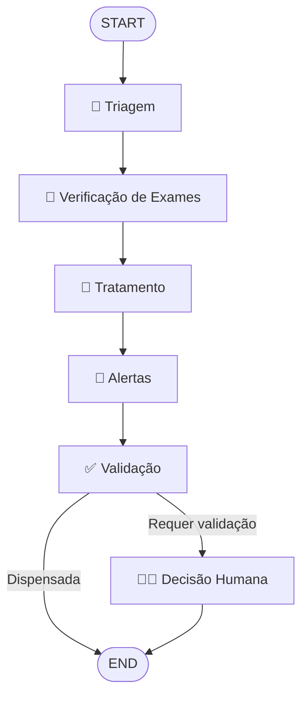

# MedAssist — Assistente Médico Virtual com IA

> Projeto Tech Challenge — Fase 3 | FIAP

Assistente médico virtual inteligente que utiliza **Fine-Tuning (QLoRA)**, **RAG (LangChain + ChromaDB)** e **Orquestração Clínica (LangGraph)** para auxiliar profissionais de saúde em decisões clínicas.

## Arquitetura

```
┌─────────────────────────────────────────────────────────┐
│                    INTERFACES (CLI/API)                  │
├─────────────────────────────────────────────────────────┤
│                   APPLICATION LAYER                      │
│  ┌──────────────┐ ┌──────────────┐ ┌──────────────────┐ │
│  │ AskClinical  │ │ProcessPatient│ │ EvaluateModel    │ │
│  │ Question     │ │              │ │                  │ │
│  └──────────────┘ └──────────────┘ └──────────────────┘ │
├─────────────────────────────────────────────────────────┤
│                    DOMAIN LAYER                          │
│  Entities │ Value Objects │ Services │ Repositories     │
├─────────────────────────────────────────────────────────┤
│                 INFRASTRUCTURE LAYER                     │
│  ┌────────┐ ┌──────────┐ ┌─────────┐ ┌──────────────┐  │
│  │ LLM    │ │LangChain │ │LangGraph│ │  Security    │  │
│  │(Falcon)│ │  (RAG)   │ │ (Flow)  │ │(Guardrails)  │  │
│  └────────┘ └──────────┘ └─────────┘ └──────────────┘  │
└─────────────────────────────────────────────────────────┘
```

## Stack Tecnológico

| Componente | Tecnologia |
|---|---|
| **Modelo Base** | Falcon-7B-Instruct |
| **Fine-Tuning** | QLoRA (4-bit NF4), PEFT, TRL SFTTrainer |
| **RAG** | LangChain + ChromaDB + sentence-transformers |
| **Orquestração** | LangGraph (StateGraph) |
| **Avaliação** | scikit-learn (Accuracy/F1) + LLM-as-Judge (OpenAI) |
| **Interface** | Typer CLI + Rich |
| **Datasets** | PubMedQA + MedQuAD |

## Estrutura do Projeto

```
medical_assistant/
├── data/                    # Pré-processamento e dados sintéticos
│   ├── preprocessing/       # Processadores PubMedQA, MedQuAD
│   └── synthetic/           # Gerador de pacientes sintéticos
├── domain/                  # Camada de domínio (DDD)
│   ├── entities/            # Patient, MedicalResponse, Alert
│   ├── value_objects/       # TriageLevel, ExamStatus, ConfidenceScore
│   ├── repositories/       # Interfaces de repositório
│   ├── services/            # TriageService, ExamService, TreatmentService
│   └── events/              # Eventos de domínio
├── application/             # Casos de uso e DTOs
│   ├── use_cases/           # AskClinicalQuestion, ProcessPatient
│   ├── dtos/                # Data Transfer Objects
│   └── interfaces/          # Interfaces de serviço (ABC)
├── infrastructure/          # Implementações concretas
│   ├── llm/                 # Falcon QLoRA Trainer + Adapter
│   ├── langchain/           # Chains, Retrievers, Prompts, Memory
│   ├── langgraph/           # Grafo clínico (StateGraph)
│   │   └── nodes/           # Triage, ExamCheck, Treatment, Alert, Validation
│   ├── persistence/         # ChromaDB VectorStore, JSON Repository
│   ├── logging/             # Audit Logger (JSONL)
│   └── security/            # Guardrails, Anonymizer, Validators
├── evaluation/              # Pipeline de avaliação
│   ├── metrics.py           # Accuracy, F1, EM, Token F1
│   ├── llm_judge.py         # LLM-as-judge (5 dimensões)
│   └── benchmark.py         # Runner comparativo
├── interfaces/              # Interfaces de usuário
│   └── cli/                 # Typer CLI (chat, flow, train, evaluate)
└── configs/                 # Configurações YAML
```

## Fluxo Clínico (LangGraph)



## Instalação

### Pré-requisitos

- Python 3.10+
- GPU com 8-12GB VRAM (para fine-tuning e inferência)
- CUDA 11.8+

### Setup

```bash
# Clonar repositório
git clone <repositório>
cd "Projeto Tech Challenge - Fase 3"

# Instalar dependências (Poetry)
pip install poetry
poetry install

# Configurar variáveis de ambiente
cp .env.example .env
# Editar .env com suas chaves (HF_TOKEN, OPENAI_API_KEY)
```

## Uso

### 1. Pré-processamento de Dados

```bash
# Pré-processar PubMedQA e MedQuAD
medassist train preprocess

# Indexar base de conhecimento no ChromaDB
medassist train index-knowledge
```

### 2. Fine-Tuning QLoRA

```bash
# Executar fine-tuning
medassist train finetune

# Com configurações customizadas
medassist train finetune --config configs/qlora_config.yaml -v
```

### 3. Gerar Pacientes Sintéticos

```bash
medassist train generate-patients --count 20
```

### 4. Chat Interativo

```bash
medassist chat
```

### 5. Pergunta Única

```bash
medassist ask "Quais são os efeitos colaterais da metformina?"
```

### 6. Fluxo Clínico Completo

```bash
medassist flow data/patients/patient_P001.json -q "Avaliação pré-operatória"
```

### 7. Avaliação

```bash
# Benchmark quantitativo
medassist evaluate benchmark --max-samples 100

# LLM-as-judge
medassist evaluate judge --max-samples 50

# Relatório consolidado
medassist evaluate report
```

## Avaliação

### Métricas Quantitativas

| Métrica | Descrição |
|---|---|
| **Accuracy** | Proporção de respostas corretas (Sim/Não/Talvez) |
| **F1 Macro** | F1-score médio entre classes |
| **F1 Weighted** | F1-score ponderado por suporte |
| **Exact Match** | Correspondência exata com referência |
| **Token F1** | F1 em nível de token |

### LLM-as-Judge (5 Dimensões)

| Dimensão | Escala | Descrição |
|---|---|---|
| **Relevância** | 1-5 | A resposta aborda a pergunta? |
| **Completude** | 1-5 | Cobre os pontos essenciais? |
| **Precisão Médica** | 1-5 | Informações médicas corretas? |
| **Segurança** | 1-5 | Evita recomendações perigosas? |
| **Citação** | 1-5 | Referencia fontes/evidências? |

## Segurança

- **Guardrails**: Filtros de entrada/saída para evitar prescrições, diagnósticos categóricos e dosagens específicas
- **Anonymizer**: Remoção de dados pessoais (CPF, RG, telefone, email)
- **Audit Logger**: Registro de todas as interações em JSONL
- **Disclaimers**: Todas as respostas incluem aviso de que não substituem consulta médica
- **Human-in-the-loop**: Validação obrigatória para casos críticos/urgentes

## Configuração

Arquivos de configuração em `configs/`:

- `model_config.yaml` — Modelo base e quantização
- `qlora_config.yaml` — Parâmetros LoRA e treinamento
- `langchain_config.yaml` — RAG, embeddings, retriever
- `guardrails_config.yaml` — Regras de segurança

## Licença

Projeto acadêmico — FIAP Tech Challenge Fase 3.

## Disclaimer

⚠️ **Este sistema é um protótipo acadêmico e NÃO deve ser utilizado para decisões médicas reais.** Sempre consulte um profissional de saúde qualificado.
