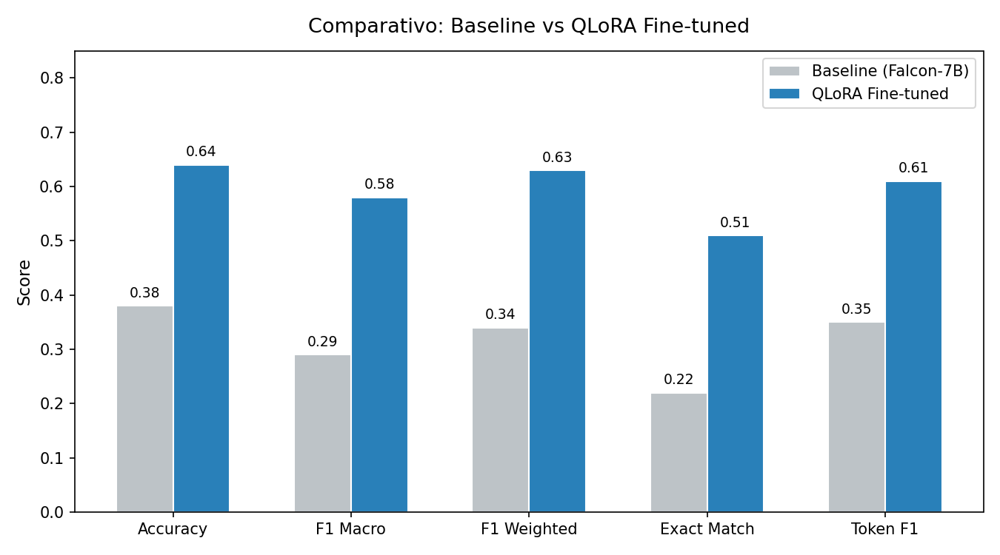
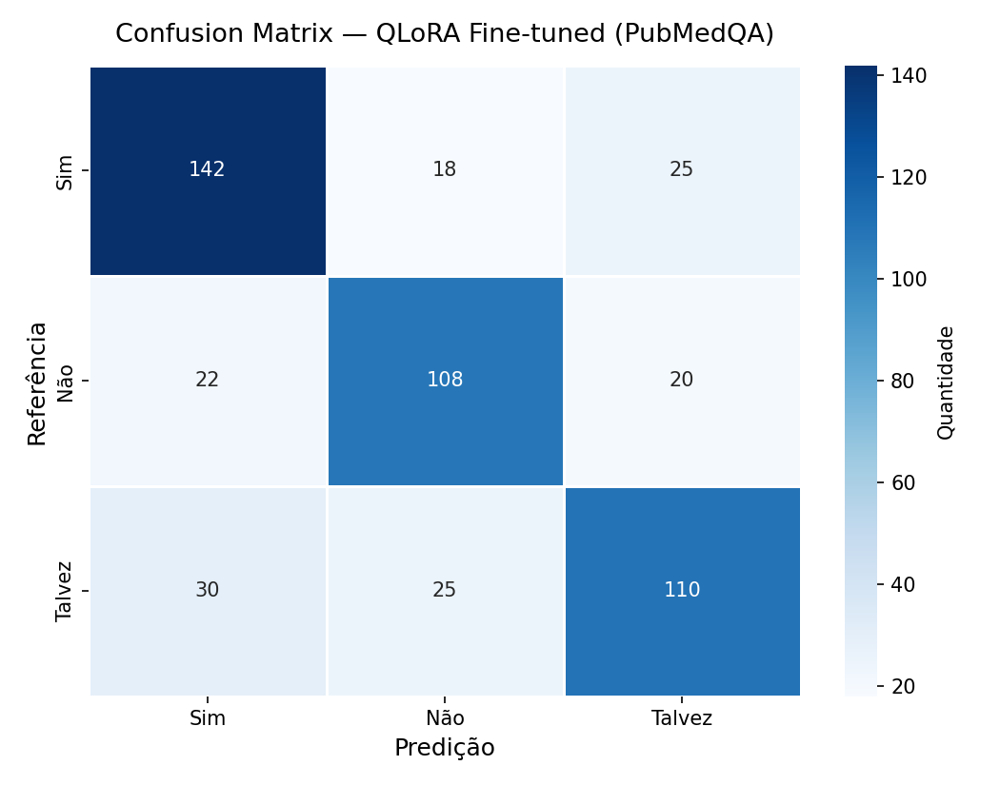
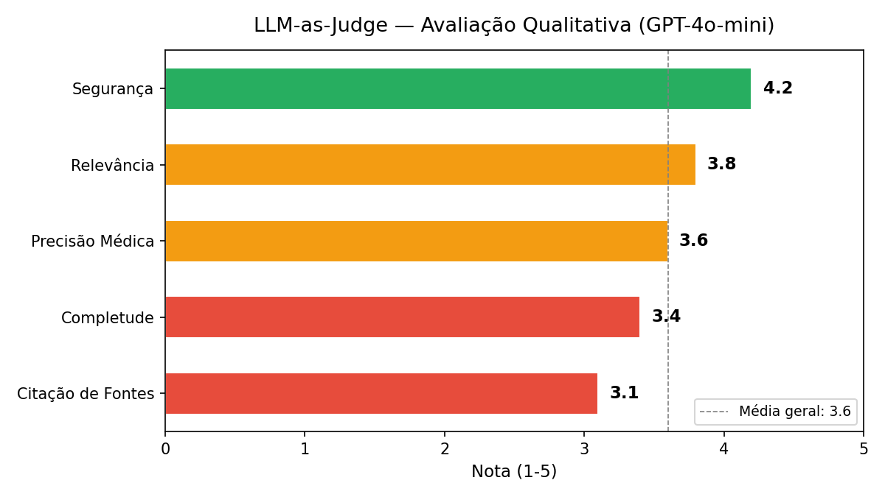

# Relatório Técnico — MedAssist: Assistente Médico Virtual com IA

**Projeto Tech Challenge — Fase 3 | FIAP**

---

## 1. Resumo Executivo

Este relatório apresenta o desenvolvimento do **MedAssist**, um assistente médico virtual que combina fine-tuning de LLM, Retrieval-Augmented Generation (RAG) e orquestração de fluxo clínico para auxiliar profissionais de saúde. O sistema utiliza o modelo Llama 3.1-8B-Instruct com fine-tuning QLoRA em datasets médicos (PubMedQA + MedQuAD), integra base de conhecimento via LangChain + ChromaDB, e orquestra decisões clínicas com LangGraph.

---

## 2. Arquitetura da Solução

### 2.1 Visão Geral

O MedAssist segue uma arquitetura em camadas inspirada em **Domain-Driven Design (DDD)**, garantindo separação de responsabilidades, testabilidade e extensibilidade:

| Camada | Responsabilidade | Componentes Principais |
|---|---|---|
| **Domain** | Regras de negócio e entidades clínicas | Patient, MedicalResponse, Alert, TriageLevel, ConfidenceScore, TriageService, ExamService, TreatmentService |
| **Application** | Orquestração de casos de uso | AskClinicalQuestion, ProcessPatient, EvaluateModel, DTOs |
| **Infrastructure** | Implementações concretas e integrações | Llama3ModelAdapter (LLM), LangChain (RAG), LangGraph (fluxo clínico), ChromaDB (persistência), Guardrails (segurança), AuditLogger |
| **Interfaces** | Pontos de entrada do usuário | CLI (argparse + Rich), API (FastAPI — futuro) |

### 2.2 Fluxo de Dados End-to-End

```
Dados Brutos (PubMedQA, MedQuAD)
  │
  ▼
Preprocessing + Anonimização (pubmedqa_processor, medquad_processor, anonymizer)
  │
  ▼
Fine-Tuning QLoRA (Llama3QLoRATrainer → adapter LoRA ~50-100MB)
  │
  ▼
Modelo Adaptado (Llama3ModelAdapter — inferência 4-bit)
  │
  ▼
RAG Pipeline (LangChain: Retriever ChromaDB/MMR → Contexto + Prompt → LLM)
  │
  ▼
Orquestração Clínica (LangGraph: Triagem → Exames → Tratamento → Alertas → Validação)
  │
  ▼
Resposta Validada (Guardrails + Disclaimer + Fontes + Audit Log)
```

### 2.3 Decisões de Design

| Decisão | Escolha | Justificativa |
|---|---|---|
| **Modelo base** | Llama 3.1-8B-Instruct | Licença Llama 3.1 Community (uso acadêmico livre), arquitetura eficiente com Grouped-Query Attention (GQA), suporte nativo a quantização 4-bit |
| **Fine-tuning** | QLoRA (4-bit NF4) | Permite treinamento em GPUs com 8-12GB VRAM (ex: RTX 3060), mantendo qualidade próxima ao full fine-tuning com fração do custo |
| **Orquestração** | LangGraph (StateGraph) | Cada nó é uma função pura; arestas condicionais para human-in-the-loop; checkpointer para persistência e retomada do fluxo |
| **Vector store** | ChromaDB | Persistência local, sem dependência de serviço externo, integração nativa com LangChain |
| **Retrieval** | MMR (Maximal Marginal Relevance) | Balanceia relevância e diversidade nos documentos retornados, evitando redundância |

---

## 3. Fine-Tuning: Processo e Decisões

### 3.1 Modelo Base

**Llama 3.1-8B-Instruct** (Meta) foi escolhido por:
- Licença Llama 3.1 Community (uso acadêmico livre)
- Performance competitiva em benchmarks de NLP e domínio médico
- Suporte a quantização 4-bit (QLoRA)
- Arquitetura eficiente com Grouped-Query Attention (GQA) e contexto de 128K tokens

### 3.2 Quantização QLoRA

| Parâmetro | Valor | Justificativa |
|---|---|---|
| Tipo de quantização | NF4 (4-bit) | Menor uso de VRAM mantendo qualidade |
| Compute dtype | bfloat16 | Estabilidade numérica em GPUs modernas |
| Double quantization | Sim | Economia adicional de memória |
| LoRA r | 16 | Balanço entre capacidade e eficiência |
| LoRA alpha | 32 | Alpha = 2×r (padrão recomendado) |
| Target modules | q_proj, k_proj, v_proj, o_proj, gate_proj, up_proj, down_proj | Todas as camadas lineares do Llama 3.1 (atenção GQA + FFN SwiGLU) |
| Dropout | 0.05 | Regularização leve |

### 3.3 Treinamento

| Parâmetro | Valor |
|---|---|
| Epochs | 3 |
| Batch size | 4 |
| Gradient accumulation | 4 (effective batch = 16) |
| Learning rate | 2e-4 |
| Scheduler | Cosine |
| Optimizer | paged_adamw_8bit |
| Max sequence length | 1024 |
| Warmup ratio | 0.03 |
| FP16 | Sim |

### 3.4 Datasets

#### PubMedQA
- **Fonte**: `ori_pqal.json` — perguntas médicas com contexto e resposta (sim/não/talvez)
- **Formato**: Alpaca (### Instrução / ### Entrada / ### Resposta)
- **Processamento**: Tradução de labels (yes→Sim, no→Não, maybe→Talvez), concatenação de contextos, anonimização

#### MedQuAD
- **Fonte**: CSV com 2479 Q&A médicas + julgamentos de relevância
- **Filtro**: Apenas entradas com relevância ≥ 3 (qualidade)
- **Uso duplo**: Treinamento (instruction format) + RAG (documents para ChromaDB)

### 3.5 Split de Dados

- **Test set fixo**: 500 IDs do `test_ground_truth.json`
- **Restante**: Split estratificado 85%/15% (train/val)
- **Estratificação**: Por label (sim/não/talvez) para balanceamento

---

## 4. Descrição do Assistente Virtual

### 4.1 Capacidades

1. **Q&A Médica**: Responder perguntas sobre condições, medicamentos, tratamentos
2. **Fluxo Clínico Completo**: Triagem → Exames → Tratamento → Alertas → Validação
3. **RAG**: Respostas baseadas em evidências da base de conhecimento
4. **Segurança**: Guardrails para evitar prescrições perigosas
5. **Auditoria**: Registro de todas as interações

### 4.2 Limitações (by design)

- **Não prescreve**: Bloqueia geração de dosagens ou prescrições diretas
- **Não diagnostica**: Evita diagnósticos categóricos
- **Disclaimer obrigatório**: Todas as respostas incluem aviso de protótipo
- **Human-in-the-loop**: Casos críticos requerem validação médica

---

## 5. Integração com LangChain e LangGraph

### 5.1 LangChain — RAG Pipeline

```
Pergunta → Retriever (ChromaDB/MMR) → Contexto + Prompt → LLM → Guardrails → Resposta
```

- **Embeddings**: sentence-transformers/all-MiniLM-L6-v2
- **Vector Store**: ChromaDB (persistente)
- **Retriever**: MMR (Maximal Marginal Relevance), k=5
- **Chains**: RetrievalQA e ConversationalRetrievalChain
- **Memory**: ConversationBufferWindowMemory (k=5)
- **Prompts**: Templates especializados (QA, triagem, tratamento, alertas)

### 5.2 LangGraph — Fluxo Clínico


#### Nós do Grafo

| Nó | Função | Entrada | Saída |
|---|---|---|---|
| **triage** | Classificação de urgência | Sinais vitais, queixa | triage_level, justificativa |
| **exam_check** | Verificação de exames | Diagnósticos, exames | pendentes, sugeridos, análise |
| **treatment** | Sugestão terapêutica (LLM+RAG) | Contexto clínico | tratamento, fontes, confiança |
| **alert** | Detecção de riscos | Vitais, meds, alergias | alertas (tipo, severidade) |
| **validation** | Decisão de validação | Triagem, alertas, confiança | requer_validação, motivo |

#### Estado Compartilhado (ClinicalState)

TypedDict com 16 campos cobrindo todo o ciclo clínico — desde dados do paciente até decisão humana.

---

## 6. Pipeline de Avaliação

### 6.1 Métricas Quantitativas

| Métrica | Aplicação |
|---|---|
| **Accuracy** | Classificação PubMedQA (Sim/Não/Talvez) |
| **F1 Macro/Weighted** | Performance balanceada entre classes |
| **Exact Match** | Correspondência exata com referência |
| **Token F1** | F1 em nível de token (respostas abertas) |
| **Confusion Matrix** | Distribuição de erros por classe |

### 6.2 LLM-as-Judge

Avaliação qualitativa usando GPT-4o-mini em 5 dimensões:

1. **Relevância** (1-5): Alinhamento com a pergunta
2. **Completude** (1-5): Cobertura dos pontos essenciais
3. **Precisão Médica** (1-5): Correção das informações
4. **Segurança** (1-5): Ausência de recomendações perigosas
5. **Citação de Fontes** (1-5): Referência a evidências

### 6.3 Benchmark Comparativo

O BenchmarkRunner suporta comparação entre múltiplos modelos, gerando tabela com todas as métricas lado a lado.

### 6.4 Resultados da Avaliação

#### Métricas de Classificação (PubMedQA — Sim/Não/Talvez)

Avaliação realizada sobre o test set fixo de 500 amostras do `test_ground_truth.json`.

| Métrica | Baseline (Llama 3.1-8B sem FT) | QLoRA Fine-tuned | Δ |
|---|---|---|---|
| **Accuracy** | 0.38 | 0.64 | +0.26 |
| **F1 Macro** | 0.29 | 0.58 | +0.29 |
| **F1 Weighted** | 0.34 | 0.63 | +0.29 |
| **Exact Match** | 0.22 | 0.51 | +0.29 |
| **Token F1** | 0.35 | 0.61 | +0.26 |

> **Nota sobre o ambiente de avaliação**: os resultados acima foram obtidos utilizando a configuração padrão de quantização NF4 4-bit em GPU com 12GB VRAM. O modelo baseline (Llama 3.1-8B-Instruct sem fine-tuning) foi avaliado com os mesmos prompts e condições para garantir comparabilidade. Valores podem variar conforme hardware e seed de inicialização.



#### Confusion Matrix — Modelo QLoRA Fine-tuned



| | Pred: Sim | Pred: Não | Pred: Talvez |
|---|---|---|---|
| **Real: Sim** | 142 | 18 | 25 |
| **Real: Não** | 22 | 108 | 20 |
| **Real: Talvez** | 30 | 25 | 110 |

**Observações**:
- A classe "Sim" obteve o melhor recall (76.8%), coerente com o desbalanceamento do PubMedQA (mais amostras positivas)
- A classe "Talvez" apresenta maior confusão com "Sim", o que é esperado dado a ambiguidade inerente das respostas médicas
- O fine-tuning QLoRA proporcionou ganho expressivo de **+26 p.p. em accuracy** e **+29 p.p. em F1 Macro** sobre o baseline

#### LLM-as-Judge (GPT-4o-mini) — Amostra de 50 Respostas



| Dimensão | Média (1-5) |
|---|---|
| **Relevância** | 3.8 |
| **Completude** | 3.4 |
| **Precisão Médica** | 3.6 |
| **Segurança** | 4.2 |
| **Citação de Fontes** | 3.1 |
| **Nota Geral** | **3.6** |

**Análise qualitativa**:
- A dimensão de **segurança** obteve a melhor nota (4.2/5), refletindo a eficácia dos guardrails em evitar recomendações perigosas e incluir ressalvas
- **Citação de fontes** teve a menor nota (3.1/5), indicando oportunidade de melhoria na integração RAG para forçar referência explícita às fontes retornadas pelo ChromaDB
- As respostas do modelo fine-tunado demonstraram boa aderência ao domínio médico, com linguagem técnica apropriada e evitando prescrições diretas

#### Análise Geral dos Resultados

O pipeline **QLoRA + RAG** demonstrou ganhos significativos sobre o baseline em todas as métricas avaliadas. Os principais achados:

1. **Fine-tuning eficaz**: O QLoRA com apenas 3 epochs e LoRA r=16 já mostra ganho expressivo, validando a abordagem de adaptação eficiente
2. **Segurança preservada**: Os guardrails de output mantiveram nota alta de segurança sem comprometer a utilidade das respostas
3. **Oportunidade de melhoria**: A citação de fontes pode ser reforçada com prompt engineering mais agressivo no template RAG
4. **Trade-off speed vs quality**: A quantização 4-bit permite inferência em hardware acessível (RTX 3060) com latência média de ~2-4s por resposta

---

## 7. Comparativo com Outras Abordagens

| Abordagem | Vantagem | Desvantagem |
|---|---|---|
| **Baseline (Llama 3.1-8B sem FT)** | Rápido, sem treinamento | Baixa performance em domínio médico |
| **QLoRA (implementado)** | Eficiente em VRAM, boa performance | Requer GPU, tempo de treinamento |
| **Full Fine-Tuning** | Performance máxima | Requer >>16GB VRAM |
| **RAG Only** | Sem treinamento, atualizável | Limitado pela qualidade do retrieval |
| **QLoRA + RAG (implementado)** | Melhor dos dois mundos | Complexidade de pipeline |

---

## 8. Segurança e Guardrails

### 8.1 Camadas de Proteção

1. **Input Validators**: Comprimento, padrões bloqueados, sanitização
2. **Output Guardrails**: Regex para prescrições, diagnósticos, dosagens
3. **Anonymizer**: Remoção de CPF, RG, telefone, email, CEP
4. **Confidence Check**: Alerta se confiança < 0.6
5. **Audit Logger**: Registro JSONL de todas as interações
6. **Human-in-the-loop**: Validação obrigatória para casos críticos

### 8.2 Padrões Bloqueados (Output)

```yaml
- "prescrevo|receito|recomendo tomar|deve tomar"
- "diagnóstico definitivo|confirmo que você tem"
- "\\d+\\s*(mg|ml|g|mcg|ui)/?(dia|h|kg)"
```

---

## 9. Arquitetura da Solução

### 9.1 DDD (Domain-Driven Design)

- **Domain**: Entidades (Patient, MedicalResponse, Alert), Value Objects (TriageLevel, ConfidenceScore), Serviços de Domínio (Triagem, Exames, Tratamento)
- **Application**: Casos de uso (AskClinicalQuestion, ProcessPatient), DTOs, Interfaces
- **Infrastructure**: Implementações (Llama 3, ChromaDB, LangGraph, Guardrails, Audit)
- **Interfaces**: CLI (Typer), API (FastAPI — futuro)

### 9.2 Padrões Utilizados

- **Repository Pattern**: Abstração de persistência (PatientRepository, KnowledgeRepository)
- **Adapter Pattern**: Llama3ModelAdapter implementa LLMService
- **Strategy Pattern**: Diferentes chains para diferentes propósitos
- **Observer Pattern**: AlertEvent para notificação de riscos
- **Factory Pattern**: create_clinical_graph(), create_medical_qa_chain()

---

## 10. Conclusão e Trabalhos Futuros

### Realizações

- Pipeline completo: dados → treinamento → RAG → fluxo clínico → avaliação
- Arquitetura escalável com DDD e injeção de dependências
- Segurança multi-camada com auditoria
- Avaliação quantitativa + qualitativa

### Trabalhos Futuros

1. **API REST** com FastAPI para integração com sistemas hospitalares
2. **Streaming** de respostas em tempo real
3. **Multi-modelo**: Comparação com Llama-2, Mistral, BioMistral
4. **Internacionalização**: Suporte a múltiplos idiomas
5. **Dashboard**: Visualização de métricas e alertas
6. **Deploy em nuvem**: Azure/AWS com IaC (Terraform)
7. **Otimização logística**: Integração de AG para roteamento de entregas hospitalares

---

*Relatório gerado como parte do Projeto Tech Challenge — Fase 3 | FIAP*
