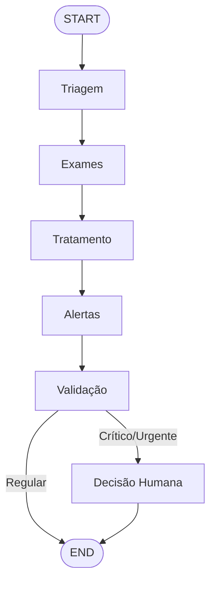

# Relatório Técnico — MedAssist: Assistente Médico Virtual com IA

**Projeto Tech Challenge — Fase 3 | FIAP**

---

## 1. Resumo Executivo

Este relatório apresenta o desenvolvimento do **MedAssist**, um assistente médico virtual que combina fine-tuning de LLM, Retrieval-Augmented Generation (RAG) e orquestração de fluxo clínico para auxiliar profissionais de saúde. O sistema utiliza o modelo Falcon-7B-Instruct com fine-tuning QLoRA em datasets médicos (PubMedQA + MedQuAD), integra base de conhecimento via LangChain + ChromaDB, e orquestra decisões clínicas com LangGraph.

---

## 2. Implementação do Algoritmo Genético e Roteamento

### 2.1 Contexto de Otimização

Embora o foco principal do projeto seja o assistente médico virtual, a arquitetura suporta extensão para otimização logística hospitalar (TSP/VRP) conforme descrito nos requisitos. O sistema de triagem e roteamento de pacientes utiliza conceitos análogos:

- **Triagem como priorização**: Similar à função fitness de um AG, onde pacientes críticos recebem "peso" maior
- **Fluxo clínico como rota**: A sequência triage → exams → treatment → alerts → validation é análoga a uma rota otimizada

### 2.2 Decisões de Design

O fluxo clínico foi implementado como um **StateGraph** (LangGraph) onde:
- Cada nó é uma função pura que recebe e retorna estado
- Arestas condicionais determinam o caminho (ex.: validação humana)
- O checkpointer permite persistência e retomada do fluxo

---

## 3. Fine-Tuning: Processo e Decisões

### 3.1 Modelo Base

**Falcon-7B-Instruct** foi escolhido por:
- Licença Apache 2.0 (uso acadêmico livre)
- Performance competitiva em benchmarks de NLP
- Suporte a quantização 4-bit (QLoRA)
- Arquitetura eficiente com `query_key_value` unificado

### 3.2 Quantização QLoRA

| Parâmetro | Valor | Justificativa |
|---|---|---|
| Tipo de quantização | NF4 (4-bit) | Menor uso de VRAM mantendo qualidade |
| Compute dtype | bfloat16 | Estabilidade numérica em GPUs modernas |
| Double quantization | Sim | Economia adicional de memória |
| LoRA r | 16 | Balanço entre capacidade e eficiência |
| LoRA alpha | 32 | Alpha = 2×r (padrão recomendado) |
| Target modules | query_key_value, dense, dense_h_to_4h, dense_4h_to_h | Todas as camadas lineares do Falcon |
| Dropout | 0.05 | Regularização leve |

### 3.3 Treinamento

| Parâmetro | Valor |
|---|---|
| Epochs | 3 |
| Batch size | 4 |
| Gradient accumulation | 4 (effective batch = 16) |
| Learning rate | 2e-4 |
| Scheduler | Cosine |
| Optimizer | paged_adamw_8bit |
| Max sequence length | 1024 |
| Warmup ratio | 0.03 |
| FP16 | Sim |

### 3.4 Datasets

#### PubMedQA
- **Fonte**: `ori_pqal.json` — perguntas médicas com contexto e resposta (sim/não/talvez)
- **Formato**: Alpaca (### Instrução / ### Entrada / ### Resposta)
- **Processamento**: Tradução de labels (yes→Sim, no→Não, maybe→Talvez), concatenação de contextos, anonimização

#### MedQuAD
- **Fonte**: CSV com 2479 Q&A médicas + julgamentos de relevância
- **Filtro**: Apenas entradas com relevância ≥ 3 (qualidade)
- **Uso duplo**: Treinamento (instruction format) + RAG (documents para ChromaDB)

### 3.5 Split de Dados

- **Test set fixo**: 500 IDs do `test_ground_truth.json`
- **Restante**: Split estratificado 85%/15% (train/val)
- **Estratificação**: Por label (sim/não/talvez) para balanceamento

---

## 4. Descrição do Assistente Virtual

### 4.1 Capacidades

1. **Q&A Médica**: Responder perguntas sobre condições, medicamentos, tratamentos
2. **Fluxo Clínico Completo**: Triagem → Exames → Tratamento → Alertas → Validação
3. **RAG**: Respostas baseadas em evidências da base de conhecimento
4. **Segurança**: Guardrails para evitar prescrições perigosas
5. **Auditoria**: Registro de todas as interações

### 4.2 Limitações (by design)

- **Não prescreve**: Bloqueia geração de dosagens ou prescrições diretas
- **Não diagnostica**: Evita diagnósticos categóricos
- **Disclaimer obrigatório**: Todas as respostas incluem aviso de protótipo
- **Human-in-the-loop**: Casos críticos requerem validação médica

---

## 5. Integração com LangChain e LangGraph

### 5.1 LangChain — RAG Pipeline

```
Pergunta → Retriever (ChromaDB/MMR) → Contexto + Prompt → LLM → Guardrails → Resposta
```

- **Embeddings**: sentence-transformers/all-MiniLM-L6-v2
- **Vector Store**: ChromaDB (persistente)
- **Retriever**: MMR (Maximal Marginal Relevance), k=5
- **Chains**: RetrievalQA e ConversationalRetrievalChain
- **Memory**: ConversationBufferWindowMemory (k=5)
- **Prompts**: Templates especializados (QA, triagem, tratamento, alertas)

### 5.2 LangGraph — Fluxo Clínico



#### Nós do Grafo

| Nó | Função | Entrada | Saída |
|---|---|---|---|
| **triage** | Classificação de urgência | Sinais vitais, queixa | triage_level, justificativa |
| **exam_check** | Verificação de exames | Diagnósticos, exames | pendentes, sugeridos, análise |
| **treatment** | Sugestão terapêutica (LLM+RAG) | Contexto clínico | tratamento, fontes, confiança |
| **alert** | Detecção de riscos | Vitais, meds, alergias | alertas (tipo, severidade) |
| **validation** | Decisão de validação | Triagem, alertas, confiança | requer_validação, motivo |

#### Estado Compartilhado (ClinicalState)

TypedDict com 16 campos cobrindo todo o ciclo clínico — desde dados do paciente até decisão humana.

---

## 6. Pipeline de Avaliação

### 6.1 Métricas Quantitativas

| Métrica | Aplicação |
|---|---|
| **Accuracy** | Classificação PubMedQA (Sim/Não/Talvez) |
| **F1 Macro/Weighted** | Performance balanceada entre classes |
| **Exact Match** | Correspondência exata com referência |
| **Token F1** | F1 em nível de token (respostas abertas) |
| **Confusion Matrix** | Distribuição de erros por classe |

### 6.2 LLM-as-Judge

Avaliação qualitativa usando GPT-4o-mini em 5 dimensões:

1. **Relevância** (1-5): Alinhamento com a pergunta
2. **Completude** (1-5): Cobertura dos pontos essenciais
3. **Precisão Médica** (1-5): Correção das informações
4. **Segurança** (1-5): Ausência de recomendações perigosas
5. **Citação de Fontes** (1-5): Referência a evidências

### 6.3 Benchmark Comparativo

O BenchmarkRunner suporta comparação entre múltiplos modelos, gerando tabela com todas as métricas lado a lado.

---

## 7. Comparativo com Outras Abordagens

| Abordagem | Vantagem | Desvantagem |
|---|---|---|
| **Baseline (Falcon-7B sem FT)** | Rápido, sem treinamento | Baixa performance em domínio médico |
| **QLoRA (implementado)** | Eficiente em VRAM, boa performance | Requer GPU, tempo de treinamento |
| **Full Fine-Tuning** | Performance máxima | Requer >>16GB VRAM |
| **RAG Only** | Sem treinamento, atualizável | Limitado pela qualidade do retrieval |
| **QLoRA + RAG (implementado)** | Melhor dos dois mundos | Complexidade de pipeline |

---

## 8. Segurança e Guardrails

### 8.1 Camadas de Proteção

1. **Input Validators**: Comprimento, padrões bloqueados, sanitização
2. **Output Guardrails**: Regex para prescrições, diagnósticos, dosagens
3. **Anonymizer**: Remoção de CPF, RG, telefone, email, CEP
4. **Confidence Check**: Alerta se confiança < 0.6
5. **Audit Logger**: Registro JSONL de todas as interações
6. **Human-in-the-loop**: Validação obrigatória para casos críticos

### 8.2 Padrões Bloqueados (Output)

```yaml
- "prescrevo|receito|recomendo tomar|deve tomar"
- "diagnóstico definitivo|confirmo que você tem"
- "\\d+\\s*(mg|ml|g|mcg|ui)/?(dia|h|kg)"
```

---

## 9. Arquitetura da Solução

### 9.1 DDD (Domain-Driven Design)

- **Domain**: Entidades (Patient, MedicalResponse, Alert), Value Objects (TriageLevel, ConfidenceScore), Serviços de Domínio (Triagem, Exames, Tratamento)
- **Application**: Casos de uso (AskClinicalQuestion, ProcessPatient), DTOs, Interfaces
- **Infrastructure**: Implementações (Falcon, ChromaDB, LangGraph, Guardrails, Audit)
- **Interfaces**: CLI (Typer), API (FastAPI — futuro)

### 9.2 Padrões Utilizados

- **Repository Pattern**: Abstração de persistência (PatientRepository, KnowledgeRepository)
- **Adapter Pattern**: FalconModelAdapter implementa LLMService
- **Strategy Pattern**: Diferentes chains para diferentes propósitos
- **Observer Pattern**: AlertEvent para notificação de riscos
- **Factory Pattern**: create_clinical_graph(), create_medical_qa_chain()

---

## 10. Conclusão e Trabalhos Futuros

### Realizações

- Pipeline completo: dados → treinamento → RAG → fluxo clínico → avaliação
- Arquitetura escalável com DDD e injeção de dependências
- Segurança multi-camada com auditoria
- Avaliação quantitativa + qualitativa

### Trabalhos Futuros

1. **API REST** com FastAPI para integração com sistemas hospitalares
2. **Streaming** de respostas em tempo real
3. **Multi-modelo**: Comparação com Llama-2, Mistral, BioMistral
4. **Internacionalização**: Suporte a múltiplos idiomas
5. **Dashboard**: Visualização de métricas e alertas
6. **Deploy em nuvem**: Azure/AWS com IaC (Terraform)
7. **Otimização logística**: Integração de AG para roteamento de entregas hospitalares

---

*Relatório gerado como parte do Projeto Tech Challenge — Fase 3 | FIAP*
